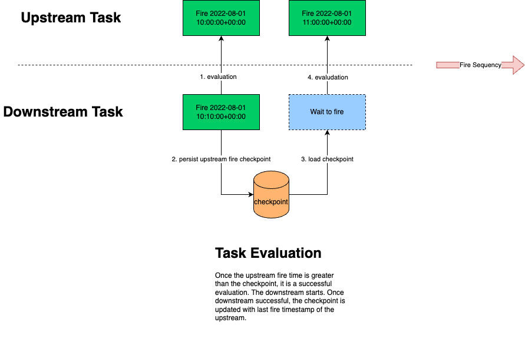

# Dependency Evaluation

## Overview

It is common that a SQL task, for example an INSERT INTO statement, starts not only when a scheduled time hits, but all
upstream tables are ready, such as latest records have been appended and specific values are found. Therefore, data
development requires dependency evaluation to determine if a downstream task should start to guarantee data integrity.

In Querystal, we abstract the procedure of data modification as two components, a task and a table.

### Task

> It is a minimum procedure of data modification, consisting of schedule time, sql statement, table information,
> dependency information, start time, end time, etc. This is minimum unit that Querystal manages the data
> modification procedure.
>
> A task execution indicates a table of the task is <b>LIKELY</b> modified.

### Table

> It is the first-class member of Querystal data warehouse. One task has <b>ONE and ONLY ONE</b> table to link with.

Therefore, the dependency evaluation has two factors, Task Evaluation and Table Evaluation.
Task evaluation is applied on the execution records to roughly indicate a table modification, in most cases, insertion.
However, table might contain specific values that are not always generated over time, such as transactions to a contract
within a period of time, or values are more than you need for current execution. In this case, you need table evaluation
along with task evaluation to start a downstream task.

In the following section, this document will clarify the details of each evaluation algorithm further.

## Task Evaluation

Each task scheduled owns a unique fire timestamp that is aligned with scheduled settings, either derived from
a cron expression or an interval. When a downstream executes itself, it looks for the fire timestamp of upstream
tasks. Once the fire timestamps of upstream are greater than the checkpoint of last execution (new execution found), the
downstream starts. The whole process is described as below:

<b>Note:</b> *Task evaluation is automatically applied to all tasks, no explicit settings are needed.*

## Table Evaluation

Table evaluation is slightly complicated than task, since data has much more flexible structure and design, leading to a
plenty of evaluation methods. Fortunately, Querystal abstracts the evaluation into two categories, STICK_LATEST and the
LOGICAL.

### Algorithm

#### Stick to the latest (STICK_LATEST)

It is common that an upstream table is appended with an incremental numeric column, such as blocks, transactions, and a
load of downstream depend on them would like to always catch up with them. In this case, you may choose STICK_LATEST
method as the evaluation algorithm.

The <b>key difference</b> between Task Evaluation and STICK_LATEST is that STICK_LATEST supports more <b>dynamic
placeholders</b> in the SQL statement to work with persisted state. This is described more in the following section.

#### Logical (LOGICAL)

The most cases, an upstream table doesn't have any increment numeric column to catch up, but is produced with an
interval, every 10 seconds, every 1 minute or daily. Therefore, a downstream should have the same or large update
schedule interval and is able to evaluate new records by the

### Dynamic Placeholders

There are several placeholders you may use in your SQL statement to render proper business logic.

| Placeholder     | Explanation                                                                                                              | Evaluation Algorithm | Example             | Data Type         |
|-----------------|--------------------------------------------------------------------------------------------------------------------------|----------------------|---------------------|-------------------|
| ${shedTs}       | Fire timestamp (UTC), all tasks contain this value.                                                                      | ALL                  | 1664166141          | INT         |
| ${shedDate}     | Fire date (UTC), all tasks contain this value.                                                                           | ALL                  | 2022-01-01          | STRING      |
| ${shedDateTime} | Fire datetime (UTC), all tasks contain this value.                                                                       | ALL                  | 2022-01-01T10:00:00 | STRING      |
| ${shedHour}     | Fire hour (UTC), all tasks contain this value.                                                                           | ALL                  | 16                  | INT         |
| ${shedMinute}   | Fire minute (UTC), all tasks contain this value.                                                                         | ALL                  | 13                  | INT         |
| ${lower}        | lower bound of the target column in STICK_LATEST, it is the max value of the column in last execution.                   | STICK_LATEST         | 123456              | BIGINT |
| ${upper}        | upper bound of the target column in STICK_LATEST, it is the max value of the column in this execution.                   | STICK_LATEST         | 456789              | BIGINT |

## Case Study

### Extract all transaction to a specific contract.

### Aggregate CEX cash flow every 1 minute.

## Conclusion

| Item                            | Features                                                                                                                                       | Limitation                                                       |
|---------------------------------|------------------------------------------------------------------------------------------------------------------------------------------------|------------------------------------------------------------------|
| Task Evaluation                 | - apply to all tasks by default.                                                                                                               | - no special dynamic placeholders except fire timestamp related. |
| Table Evaluation (STICK_LATEST) | - automatically persist the checkpoints of the upstream. - support ${lower} and ${upper} as the placeholders to inject checkpoints in SQL. | - upstream table must has an incremental numeric column.         |
| Table Evaluation (LOGICAL)      | - custom SQL clauses with placeholders.                                                                                                        | - upstream table must has fire timestamp related column.         |