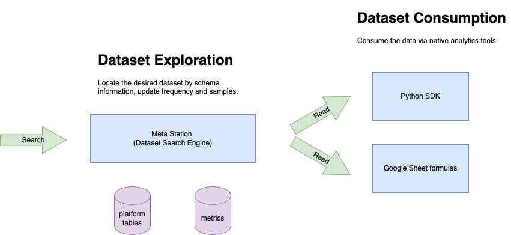

# Consumer

Querystal provides a unifed query gateway to access massive types of datasets. With strong query solutions, the unified
query gateway guarantees a stable, unlimited concurrency and cost efficiency API.

## Overview

To consume the dataset, the procedure is described as below:

## Data Exploration

You can easily explore the dataset via Meta Station. It is a dataset search engine with in-place data exploration tools.

### Dataset

Identify the desired data by information below:

* database name
* dataset name
* measures
* filters

### Dataset with Ticker

If a dataset has a ticker, you can identify the desired data by information below:

* ticker
* measures
* filters

## Data Consumption

Querystal has supported clients below:

* [Python 3 SDK - PyQuerystal](python/python-sdk.md)
* [Google Sheet Add-on](googlesheet/googlesheet-add-on.md)
* [Key-Value Fetch](kv.md)